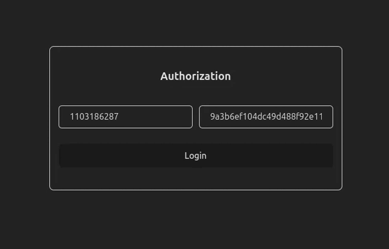

# whatsapp-chat



Тестовое задание на позицию фронтенд разработчик для компании [Грин-Апи](https://green-api.com/)

## Запустить локально

```zsh
git clone git@github.com:MiCkEyZzZ/whatsapp-chat.git
cd whatsapp-chat
npm install
npm run start
```

## Пиграть онлайн

[ссылка](https://whatsapp-chat-gilt.vercel.app/)

## Используемые технологии

- [React](https://react.dev/)
- [Tailwindcss](https://tailwindcss.com/)
- [TypeScript](https://www.typescriptlang.org/)
- [GREEN-API](https://green-api.com)
- [Vite](https://vite.dev/)
- [Vercel](https://vercel.com/)

## Функциональность приложения

- авторизация в чате
- создание чатов
- приём и отправка сообщений
